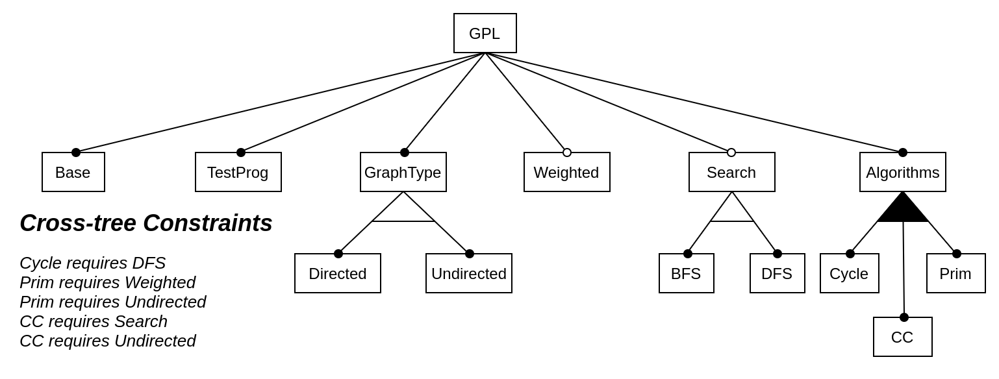

# Graph Product Line

*Based on specification defined in [1,2]*

## Feature model

## Features
- Base: read graph from a file
- TestProg: creates the objects to represent the graph, and calls the algorithms of the family members of the graph
- GraphType
- Weighted
- Search
- Algorithms

## Feature configurations
Possible feature configurations:
- Undirected /\ Weighted /\ Prim /\ !Directed /\ !CC /\ !DFS /\ !BFS /\ !Cycle
- Undirected /\ Weighted /\ DFS /\ Prim /\ !Directed /\ !CC /\ !BFS /\ !Cycle
- Undirected /\ Weighted /\ BFS /\ Prim /\ !Directed /\ !CC /\ !DFS /\ !Cycle
- Undirected /\ DFS /\ CC /\ !Directed /\ !Weighted /\ !Prim /\ !BFS /\ !Cycle
- Undirected /\ BFS /\ CC /\ !Directed /\ !Weighted /\ !Prim /\ !DFS /\ !Cycle
- Undirected /\ Weighted /\ DFS /\ CC /\ !Directed /\ !Prim /\ !BFS /\ !Cycle
- Undirected /\ Weighted /\ BFS /\ CC /\ !Directed /\ !Prim /\ !DFS /\ !Cycle
- Undirected /\ Weighted /\ DFS /\ CC /\ Prim /\ !Directed /\ !BFS /\ !Cycle
- Undirected /\ Weighted /\ BFS /\ CC /\ Prim /\ !Directed /\ !DFS /\ !Cycle
- Undirected /\ DFS /\ Algorithm /\ Cycle /\ !Directed /\ !Weighted /\ !Prim /\ !Algorithm /\ !CC /\ !BFS
- Undirected /\ Weighted /\ DFS /\ Cycle /\ !Directed /\ !Prim /\ !CC /\ !BFS
- Undirected /\ Weighted /\ DFS /\ Cycle /\ Prim /\ !Directed /\ !CC /\ !BFS
- Undirected /\ DFS /\ Cycle /\ CC /\ !Directed /\ !Weighted /\ !Prim /\ !BFS
- Undirected /\ Weighted /\ DFS /\ Cycle /\ CC /\ !Directed /\ !Prim /\ !BFS
- Undirected /\ Weighted /\ DFS /\ Cycle /\ CC /\ Prim /\ !Directed /\ !BFS
- Directed /\ DFS /\ Cycle /\ !Weighted /\ !Prim /\ !CC /\ !BFS /\ !Undirected
- Directed /\ Weighted /\ DFS /\ Cycle /\ !Prim /\ !CC /\ !BFS /\ !Undirected

## Graph Implementation
There will have two possible implementation for the Graph, based on wheter or not the feature _Weighted_ is enabled:

- ### Weighted Graph Implementation
	- Graph: class comprising a list of Node + list of Edges + Search Algorithm + Set of Graph Algorithms*
	- Node: class comprising list of Neighbor elements
	- Neighbor: class comprising reference to a neighbor Node + reference to correspondent Edge
	- Edge: class comprising Start Node + End Node + Weight

_*One or more of the following: cycle-checking, connected components, strongly-connected components, MST Prim, MST Kruskal, Shortest Path_

- ### Unweighted Graph Implementation
	- Graph: class comprising a list of Node + Search Algorithm + Set of Graph Algorithms**
	- Node: class comprising adjacency list of the Node
	
_**One or more of the following: cycle-checking, connected components, strongly-connected components_

## References
1. Lopez-Herrejon, Roberto E., and Alexander Egyed. "Towards fixing inconsistencies in models with variability." Proceedings of the Sixth International Workshop on Variability Modeling of Software-Intensive Systems. 2012.
2. Lopez-Herrejon, Roberto E., and Don Batory. "A standard problem for evaluating product-line methodologies." International Symposium on Generative and Component-Based Software Engineering. Springer, Berlin, Heidelberg, 2001. 
